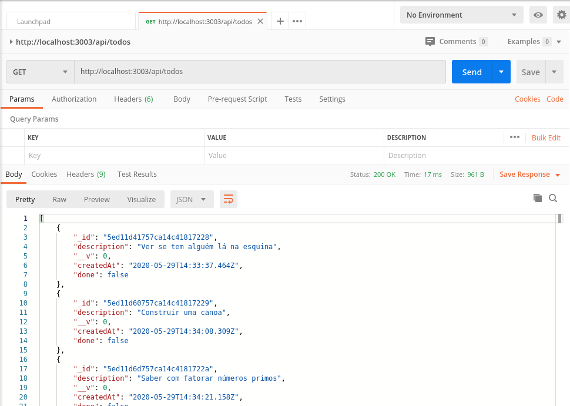

<h1> React todo App</h1>

Projeto simples destinado ao aperfeiçoamento no framework React.
    Trata-se de um App desenvolvido com o backend em nodejs e com uma base de dados em MongoDB, e o frontend desenvolvido com React.
    As funcionalidades do app são bem básicas e servem apenas para explorar o conteúdo do framework.
    Com ele é possível acrescentar uma tarefa e excluí-la depois de ter sido realizada. Na aba sobre é possível encontrar uma descrição do app.

Links Úteis: 

<a href="https://pt-br.reactjs.org/">https://pt-br.reactjs.org/</a>

<a href="https://www.mongodb.com/">https://www.mongodb.com/</a>

<a href="https://mongoosejs.com/">https://mongoosejs.com/</a>

<a href="https://www.postman.com/">https://www.postman.com/</a>

<h3>Aparência da home</h3>

Utilização do Postman:

OBS: para funcionar o projeto é preciso que primeiro acesse cada
     pasta e rode npm i. Depois verificar as portas que se 
     encontram cada parte do projeto pra visualizar.
